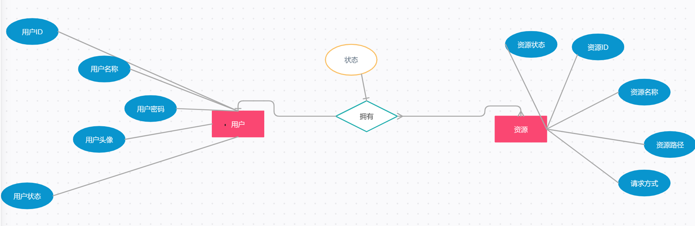

## 项目简介
该项目是基于提升[MindMap](https://github.com/Erym5/mindMap)上线体验，集成站内聊天系统，基于(KT-Chat)开发  基于这俩个项目的开发[总结](https://blog.csdn.net/haosongmanzou/article/details/129356172)

## 项目改善
1. 增加用户认证子模块，集成security oauth、jwt、jcasbin，为了满足 IM 系统中访问控制模型的动态性，选取 jcasbin 为鉴权框架，使用 PBAC 模型进
行ABAC、RBAC权限模型集成，选取security oauth2为认证框架，较单一的security进行认证与鉴权更为快速的开发与解耦；与 gateway 整合，进行路由、鉴权。整合swagger文档。
2. 完善Netty网络编程开发，增加线程池、建立路由表等

## 数据库设计
### RBAC E-R

### RBAC DB Table

### ABAC E-R

### ABAC DB Table

## 项目进度
暂时仅论证项目可行性，启动user-auth、gateway、user-info模块后输入、

未完待续 
1、用户密码数据进行加密处理以满足security框架 
2、使用security框架进一步预防网络攻击 
3、自定义模型与权限数据进行权限粒度的确定（如禁言则在user中增加ban属性进行ABAC访问控制） 
4、处理代码冗余、数据合并、方法逻辑（如：登录） 
暂不继续

## 参考项目
[KT-Chat](https://github1s.com/KimTou/KT-Chat)、
[Jcasbin-Demo](https://github.com/VINO42/jcasbin-springboot-demo)、
[SpringCloud-Study](https://github1s.com/macrozheng/springcloud-learning)